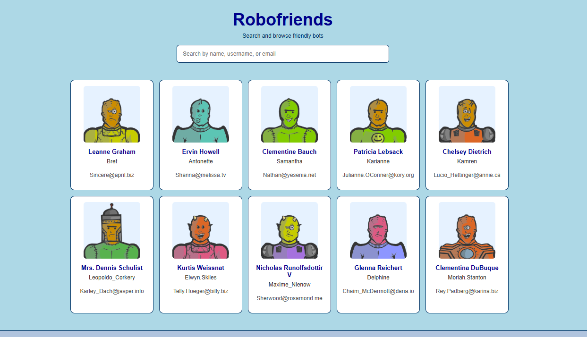

# Robofriends 👾

A simple, interactive web app that displays a list of robot friends fetched from a public API. Users can search and filter robots by name, username, or email. Built with vanilla HTML, CSS, and JavaScript — no frameworks required.

## 🚀 Demo

Live Demo: [(Add your GitHub Pages / Netlify link once deployed)](https://ysayaovong.github.io/RoboFriends/)

## ✨ Features

Light blue background with a dark blue header/logo.

Fetches user data from the JSONPlaceholder API
.

Robot images generated using RoboHash
.

Responsive grid layout: 5 robots per row, wrapping to the next line.

Real-time search filtering by name, username, or email.

Hover effects on cards for interactivity.

## 🛠️ Technologies Used

HTML5 – structure

CSS3 – styling & layout (CSS Grid)

JavaScript (ES6) – data fetching & DOM manipulation

Fetch API – get user data from JSONPlaceholder

RoboHash API – generate robot avatars

## 📂 Project Structure
robofriends/
│── index.html     # Main HTML file

│── styles.css     # Styling (light blue background, dark blue header)

│── script.js      # Logic for fetching and rendering robots

│── screenshot.png # (optional) screenshot for README

## ⚡ Getting Started

Clone the repository

git clone https://github.com/YOUR_USERNAME/robofriends.git
cd robofriends

Open the app
Simply open index.html in your browser.
(No server or build process required)

## 📸 Example

When you open the app, you’ll see a list of robot cards:

Each robot has a name, username, and email.

Use the search bar to filter robots dynamically.

## 🔮 Future Improvements

Add custom local data as an offline fallback.

Dark mode / theme switcher.

Deploy to GitHub Pages or Netlify for easy sharing.

## 📜 License

This project is open source and available under the MIT License
.
